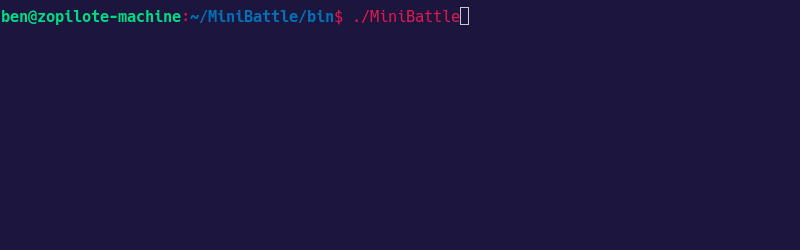

# Mini Battle (Simulator)

Mini Battle simulator is a command line application that simulates battle between creatures. In the current version 0.2.0 a dual between an "Onion Knight" and a "Potato Knight" unfolds. The stats and weapons are randomly generated on each run.

## Example

## Releases

- Version 0.1.0
  - New creatures have randomly generated STR, DEX, and MAG in the range of 5-15.
  - Hit points are calculated as 2x STR and stamina points are 2x DEX. MAG is currently unused.
  - Each round of battle the creatures have a 50/50 chance to be the creature that attacks.
    - An attack costs 10 stamina points and does a flat 5 damage to the opponents hit points.
    - If a creature can not attack because of too few stamina points then it rests and regains 10 points.

- Version 0.2.0
  - New creatures have a random weapon.
    - Current weapon kinds:  dagger, sword, unarmed, club, rapier, axe, spear, wand, improvised.
    - Weapon kinds have one of 4 assigned damage types: blunt, slicing, piercing, magical.
  - Weapons have an affinity based off their damage type.
    - An affinity multiplier increases the attack of the weapon based on the creature's matching stat. 
